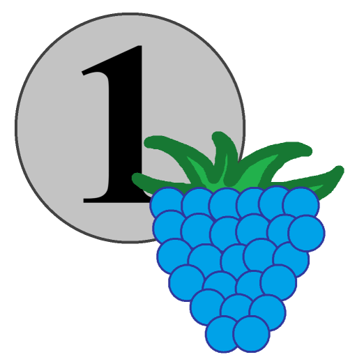

<h1 align="center">Unions</h1>

  

## Simple cross-platform game

## Description

Lightweight cross-platform time-killer game.

Merge identical objects to obtain a new, higher-level object.

## Screenshots

<table>
  <tr>
    <td align="center"> Main menu</td>
    <td align="center"> Settings</td>
    <td align="center"> Pause</td>
  </tr>
  <tr>
    <td align="center"> Coins level</td>
    <td align="center"> Game over</td>
    <td></td>
  </tr>
</table>

# Available platforms:

1. Windows (`Unions-Game-win64.zip` asset in Releases)
2. Android (`Unions-Game-*.apk` asset in Releases)

## Available levels

There are currently levels available in the game:
1) With coins of the Central Bank of the Russian Federation
2) With Fruits
3) With planets

## Install and Run

### Windows

* Download `Unions-Game-win64.zip` (asset in Releases)
* Extract it to a convenient location
* Run `Unions.exe`

### Android

* Download `Unions-Game-*.apk` (asset in Releases)
* Install the APK (you may need to allow installs from unknown sources)
* Launch the game

## Used libraries:
* [SDL3 3.4.0, SDL3_image 3.4.0, SDL3_mixer 3.1.2](https://github.com/libsdl-org) - Graphics library + audio (SDL_mixer)
* [SDLWrapper 0.2.0](https://github.com/Igorantivirus/SDL_Wrapper) - C++ OOP wrapper over SDL3
* [RmlUi 6.2](https://github.com/mikke89/RmlUi) - HTML/CSS-like UI library
* [FreeType 2.14.1](https://freetype.org/) - Font rendering library
* [pugixml 1.15](https://github.com/zeux/pugixml) - XML parsing library
* [Box2D 2.4.2](https://github.com/erincatto/box2d) - Physics engine library

## Used fonts:
* DejaVu Sans

## License
MIT License
